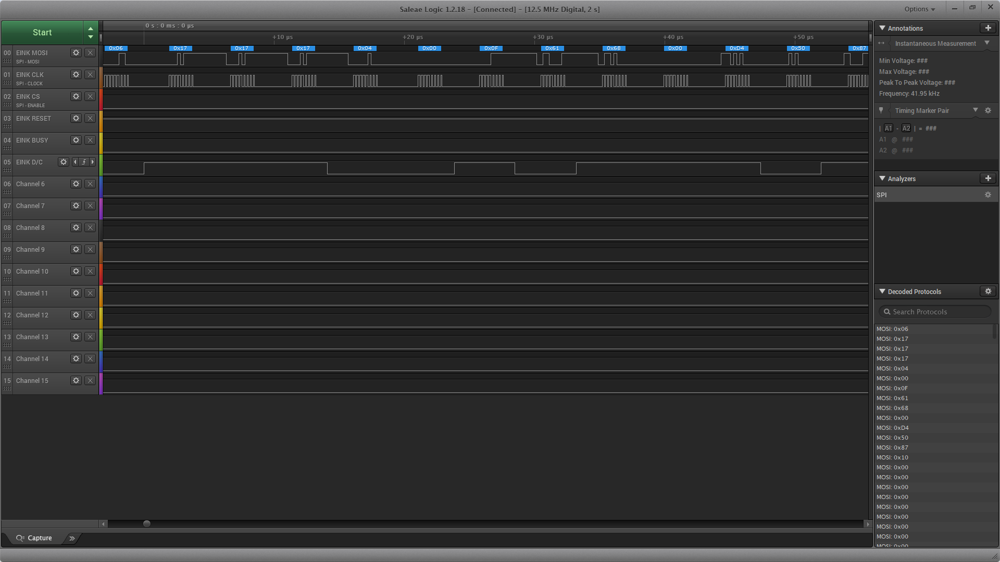

 
 
 
 
 

# emWin_eInk_2_13_FreeRTOS

  

### About the project
___
I had purchased the eInk display a while back, and to be honest, I do not recalls from where. Good thing I also bought the breakout board which would then allow me to easily connect to them via a standard breadboard.   
The display I am using is made by Goodisplay, same with the board. I was able to get the datasheet and the schematic for the products I am using, so will add them for reference.   
You can find the details of the displays and the board supporting them on the [GDEW0213Z16 Display Product Page](https://www.good-display.com/products_detail/productId%3d310.html). I included the relevant documents here, but I will not be updating with new versions, so always go to the source linked above.   
This project is based on the [P6FreeRTOS w/ Tracealyzer](https://github.com/HElkhoury/P6FreeRTOSTickless), so it has support for tracealyzer if you chose to enable it. also has support for the low power operation.   
The library was taken from [waveshare eink code](https://github.com/waveshare/e-Paper) and adapted to work with PSoC6.   

### Built With
___

IDE: ModusToolbox 2.1 IDE   
Hardware: CY8CKIT-062S2-43012   

### Getting Started
___

#### Using this project
Fork the repo or clone, and get started with the main.c by adding your code for any initialization for your system, any other tasks, etc. This is  skelleton project, so there is plenty of MCU power left t do what you need with it. If you want to use tracealyzer, refer to the [P6FreeRTOS w/ Tracealyzer](https://github.com/HElkhoury/P6FreeRTOSTickless) for setup.   
I created a task for blinking the LED, just a heartbeat to make sure the project is running.   
The eInk task initializes the eInk display, displays a few screens to test the colors and objects, then puts the eInk display to sleep. the rest of the task just blink an LED and does nothing to the display. You can add your programs in the task loop.    
TODO: Add fritzinv diagram when done

  

The eInk comes with a few different startup sequence. If you wish to play around with the startup, make sure you read the details in the datasheet, and have a logic analyzer handy. This is not something you can debug with a blinking LED and a debug terminal.
Sequence per datasheet:

  
 

### Important Notice!
___

If you look at the high level spec for the display, you will notice that this specific display does not allow partial refresh. which means that you have to update the complete display even if you changed a single pixel.   
Issue number 2 is that it take a LONG time (in terms of MCU time) to update the display. The specification states 16 seconds. So this makes a cool display only usable for static usage. So you can use it to display information which does not change, or changes very very sowy. A thought is a battery powered wine fridge temperature and humidity meter which you can place inside the fridge and will only wake up once a minute or so and measure, update, then go back to deep sleep. I'm sure there are other projects, but you know the limitation before you start. There are other displays which support partial refresh, still requiring about 1s to update. enjoy!   

<table border="0" cellpadding="0" cellspacing="0" style="width: 750px; border-collapse: collapse; margin-left: -0.25pt;">
<tbody>
<tr style="height: 31px;">
<td style="border-top: windowtext 1pt solid; height: 31px; border-right: windowtext 1pt solid; width: 291px; border-bottom: windowtext 1pt solid; padding-bottom: 0cm; padding-top: 0cm; padding-left: 5.4pt; border-left: windowtext 1pt solid; padding-right: 5.4pt; background-size: initial; background-origin: initial; background-clip: initial;">

Model

</td>
<td style="border-top: windowtext 1pt solid; height: 31px; border-right: windowtext 1pt solid; width: 291px; border-bottom: windowtext 1pt solid; padding-bottom: 0cm; padding-top: 0cm; padding-left: 5.4pt; border-left-style: none; padding-right: 5.4pt; background-size: initial; background-origin: initial; background-clip: initial;">

GDEW0213Z16

</td>
</tr>
<tr style="height: 25px;">
<td style="border-top-style: none; height: 25px; border-right: windowtext 1pt solid; width: 291px; border-bottom: windowtext 1pt solid; padding-bottom: 0cm; padding-top: 0cm; padding-left: 5.4pt; border-left: windowtext 1pt solid; padding-right: 5.4pt; background-size: initial; background-origin: initial; background-clip: initial;">

Dimension

</td>
<td style="border-top-style: none; height: 25px; border-right: windowtext 1pt solid; width: 291px; border-bottom: windowtext 1pt solid; padding-bottom: 0cm; padding-top: 0cm; padding-left: 5.4pt; border-left-style: none; padding-right: 5.4pt; background-size: initial; background-origin: initial; background-clip: initial;">

59.2(H)&times;29.2 (V) &times;0.98(D)mm

</td>
</tr>
<tr style="height: 31px;">
<td style="border-top-style: none; height: 31px; border-right: windowtext 1pt solid; width: 291px; border-bottom: windowtext 1pt solid; padding-bottom: 0cm; padding-top: 0cm; padding-left: 5.4pt; border-left: windowtext 1pt solid; padding-right: 5.4pt; background-size: initial; background-origin: initial; background-clip: initial;">

Screen Size

</td>
<td style="border-top-style: none; height: 31px; border-right: windowtext 1pt solid; width: 291px; border-bottom: windowtext 1pt solid; padding-bottom: 0cm; padding-top: 0cm; padding-left: 5.4pt; border-left-style: none; padding-right: 5.4pt; background-size: initial; background-origin: initial; background-clip: initial;">

2.13inch

</td>
</tr>
<tr style="height: 31px;">
<td style="border-top-style: none; height: 31px; border-right: windowtext 1pt solid; width: 291px; border-bottom: windowtext 1pt solid; padding-bottom: 0cm; padding-top: 0cm; padding-left: 5.4pt; border-left: windowtext 1pt solid; padding-right: 5.4pt; background-size: initial; background-origin: initial; background-clip: initial;">

Resolution

</td>
<td style="border-top-style: none; height: 31px; border-right: windowtext 1pt solid; width: 291px; border-bottom: windowtext 1pt solid; padding-bottom: 0cm; padding-top: 0cm; padding-left: 5.4pt; border-left-style: none; padding-right: 5.4pt; background-size: initial; background-origin: initial; background-clip: initial;">

212(H)&times;104(V)

</td>
</tr>
<tr style="height: 31px;">
<td style="border-top-style: none; height: 31px; border-right: windowtext 1pt solid; width: 291px; border-bottom: windowtext 1pt solid; padding-bottom: 0cm; padding-top: 0cm; padding-left: 5.4pt; border-left: windowtext 1pt solid; padding-right: 5.4pt; background-size: initial; background-origin: initial; background-clip: initial;">

Pixel Pitch

</td>
<td style="border-top-style: none; height: 31px; border-right: windowtext 1pt solid; width: 291px; border-bottom: windowtext 1pt solid; padding-bottom: 0cm; padding-top: 0cm; padding-left: 5.4pt; border-left-style: none; padding-right: 5.4pt; background-size: initial; background-origin: initial; background-clip: initial;">

0.229&times;0.228mm

</td>
</tr>
<tr style="height: 29px;">
<td style="border-top-style: none; height: 29px; border-right: windowtext 1pt solid; width: 291px; border-bottom: windowtext 1pt solid; padding-bottom: 0cm; padding-top: 0cm; padding-left: 5.4pt; border-left: windowtext 1pt solid; padding-right: 5.4pt; background-size: initial; background-origin: initial; background-clip: initial;">

Active Area

</td>
<td style="border-top-style: none; height: 29px; border-right: windowtext 1pt solid; width: 291px; border-bottom: windowtext 1pt solid; padding-bottom: 0cm; padding-top: 0cm; padding-left: 5.4pt; border-left-style: none; padding-right: 5.4pt; background-size: initial; background-origin: initial; background-clip: initial;">

48.55 (H)&times;23.80 (V)mm

</td>
</tr>
<tr style="height: 31px;">
<td style="border-top-style: none; height: 31px; border-right: windowtext 1pt solid; width: 291px; border-bottom: windowtext 1pt solid; padding-bottom: 0cm; padding-top: 0cm; padding-left: 5.4pt; border-left: windowtext 1pt solid; padding-right: 5.4pt; background-size: initial; background-origin: initial; background-clip: initial;">

Weight

</td>
<td style="border-top-style: none; height: 31px; border-right: windowtext 1pt solid; width: 291px; border-bottom: windowtext 1pt solid; padding-bottom: 0cm; padding-top: 0cm; padding-left: 5.4pt; border-left-style: none; padding-right: 5.4pt; background-size: initial; background-origin: initial; background-clip: initial;">

3.36&plusmn;0.5

</td>
</tr>
<tr style="height: 31px;">
<td style="border-top-style: none; height: 31px; border-right: windowtext 1pt solid; width: 291px; border-bottom: windowtext 1pt solid; padding-bottom: 0cm; padding-top: 0cm; padding-left: 5.4pt; border-left: windowtext 1pt solid; padding-right: 5.4pt; background-size: initial; background-origin: initial; background-clip: initial;">
Current of the refresh(mA)</td>
<td style="border-top-style: none; height: 31px; border-right: windowtext 1pt solid; width: 291px; border-bottom: windowtext 1pt solid; padding-bottom: 0cm; padding-top: 0cm; padding-left: 5.4pt; border-left-style: none; padding-right: 5.4pt; background-size: initial; background-origin: initial; background-clip: initial;">
8</td>
</tr>
<tr style="height: 31px;">
<td style="border-top-style: none; height: 31px; border-right: windowtext 1pt solid; width: 291px; border-bottom: windowtext 1pt solid; padding-bottom: 0cm; padding-top: 0cm; padding-left: 5.4pt; border-left: windowtext 1pt solid; padding-right: 5.4pt; background-size: initial; background-origin: initial; background-clip: initial;">
Power consumption of the refresh(mW)</td>
<td style="border-top-style: none; height: 31px; border-right: windowtext 1pt solid; width: 291px; border-bottom: windowtext 1pt solid; padding-bottom: 0cm; padding-top: 0cm; padding-left: 5.4pt; border-left-style: none; padding-right: 5.4pt; background-size: initial; background-origin: initial; background-clip: initial;">
26.4</td>
</tr>
<tr style="height: 31px;">
<td style="border-top-style: none; height: 31px; border-right: windowtext 1pt solid; width: 291px; border-bottom: windowtext 1pt solid; padding-bottom: 0cm; padding-top: 0cm; padding-left: 5.4pt; border-left: windowtext 1pt solid; padding-right: 5.4pt; background-size: initial; background-origin: initial; background-clip: initial;">
Standby power consumption Pc(mW)</td>
<td style="border-top-style: none; height: 31px; border-right: windowtext 1pt solid; width: 291px; border-bottom: windowtext 1pt solid; padding-bottom: 0cm; padding-top: 0cm; padding-left: 5.4pt; border-left-style: none; padding-right: 5.4pt; background-size: initial; background-origin: initial; background-clip: initial;">
0.0165</td>
</tr>
<tr style="height: 31px;">
<td style="border-top-style: none; height: 31px; border-right: windowtext 1pt solid; width: 291px; border-bottom: windowtext 1pt solid; padding-bottom: 0cm; padding-top: 0cm; padding-left: 5.4pt; border-left: windowtext 1pt solid; padding-right: 5.4pt; background-size: initial; background-origin: initial; background-clip: initial;">
Time of refresh(s)</td>
<td style="border-top-style: none; height: 31px; border-right: windowtext 1pt solid; width: 291px; border-bottom: windowtext 1pt solid; padding-bottom: 0cm; padding-top: 0cm; padding-left: 5.4pt; border-left-style: none; padding-right: 5.4pt; background-size: initial; background-origin: initial; background-clip: initial;">
16</td>
</tr>
<tr style="height: 31px;">
<td style="border-top-style: none; height: 31px; border-right: windowtext 1pt solid; width: 291px; border-bottom: windowtext 1pt solid; padding-bottom: 0cm; padding-top: 0cm; padding-left: 5.4pt; border-left: windowtext 1pt solid; padding-right: 5.4pt; background-size: initial; background-origin: initial; background-clip: initial;">
Time of partial refresh(s)</td>
<td style="border-top-style: none; height: 31px; border-right: windowtext 1pt solid; width: 291px; border-bottom: windowtext 1pt solid; padding-bottom: 0cm; padding-top: 0cm; padding-left: 5.4pt; border-left-style: none; padding-right: 5.4pt; background-size: initial; background-origin: initial; background-clip: initial;">
--</td>
</tr>
</tbody>
</table>

### Contributing
___
Contributions are what make the open source community such an amazing place to be learn, inspire, and create. Any contributions you make are **greatly appreciated**.

1. Fork the Project
2. Create your Feature Branch (`git checkout -b feature/AmazingFeature`)
3. Commit your Changes (`git commit -m 'Add some AmazingFeature'`)
4. Push to the Branch (`git push origin feature/AmazingFeature`)
5. Open a Pull Request

### License
___
Distributed under the MIT License. See `LICENSE` for more information.

### Contact
___
Project Link: [P6FreeRTOS w/ 2.13in EInk Display](https://github.com/HElkhoury/emWin_eInk_2_13_FreeRTOS)

### Acknowledgements
___
* [Img Shields](https://shields.io)
* [Choose an Open Source License](https://choosealicense.com)
* [GitHub Pages](https://pages.github.com)
* [IoTExpert](https://iotexpert.com/)
* [waveshare eink code](https://github.com/waveshare/e-Paper)
### End
