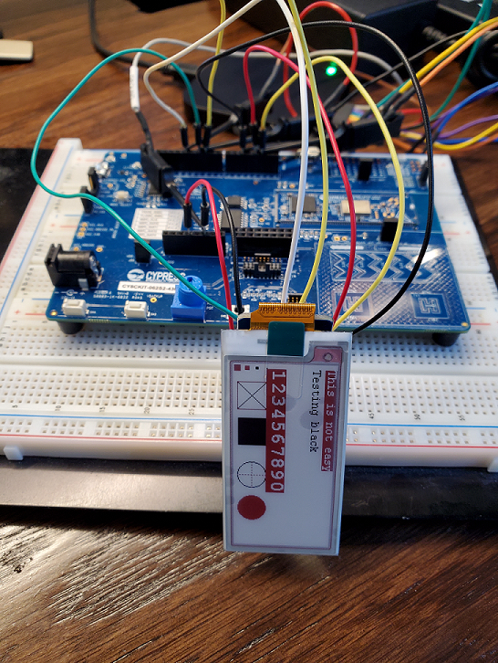

 
 
 
 
 

# emWin_eInk_2_13_FreeRTOS

  

### About the project
___
I had purchased the eInk display a while back, and to be honest, I do not recalls from where. Good thing I also bought the breakout board which would then allow me to easily connect to them via a standard breadboard.   
The display I am using is made by Goodisplay, same with the board. I was able to get the datasheet and the schematic for the products I am using, so will add them for reference.   
TODO: Add links to the datasheet and schematic   
This project is based on the [P6FreeRTOS w/ Tracealyzer](https://github.com/HElkhoury/P6FreeRTOSTickless), so it has support for tracealyzer if you chose to enable it. also has support for the low power operation.   
The library was taken from [waveshare eink code](https://github.com/waveshare/e-Paper) and adapted to work with PSoC6.   

### Built With
___

IDE: ModusToolbox 2.1 IDE   
Hardware: CY8CKIT-062S2-43012   

### Getting Started
___

#### Using this project
Fork the repo or clone, and get started with the main.c by adding your code for any initialization for your system, any other tasks, etc. This is  skelleton project, so there is plenty of MCU power left t do what you need with it. If you want to use tracealyzer, refer to the [P6FreeRTOS w/ Tracealyzer](https://github.com/HElkhoury/P6FreeRTOSTickless) for setup.   
I created a task for blinking the LED, just a heartbeat to make sure the project is running.   
The eInk task initializes the eInk display, displays a few screens to test the colors and objects, then puts the eInk display to sleep. the rest of the task just blink an LED and does nothing to the display. You can add your programs in the task loop.    
TODO: Add fritzinv diagram when done

  

The eInk comes with a few different startup sequence. If you wish to play around with the startup, make sure you read the details in the datasheet, and have a logic analyzer handy. This is not something you can debug with a blinking LED and a debug terminal.
Sequence per datasheet:

  
 

### Contributing
___
Contributions are what make the open source community such an amazing place to be learn, inspire, and create. Any contributions you make are **greatly appreciated**.

1. Fork the Project
2. Create your Feature Branch (`git checkout -b feature/AmazingFeature`)
3. Commit your Changes (`git commit -m 'Add some AmazingFeature'`)
4. Push to the Branch (`git push origin feature/AmazingFeature`)
5. Open a Pull Request

### License
___
Distributed under the MIT License. See `LICENSE` for more information.

### Contact
___
Project Link: [P6FreeRTOS w/ 2.13in EInk Display](https://github.com/HElkhoury/emWin_eInk_2_13_FreeRTOS)

### Acknowledgements
___
* [Img Shields](https://shields.io)
* [Choose an Open Source License](https://choosealicense.com)
* [GitHub Pages](https://pages.github.com)
* [IoTExpert](https://iotexpert.com/)
* [waveshare eink code](https://github.com/waveshare/e-Paper)
### End
